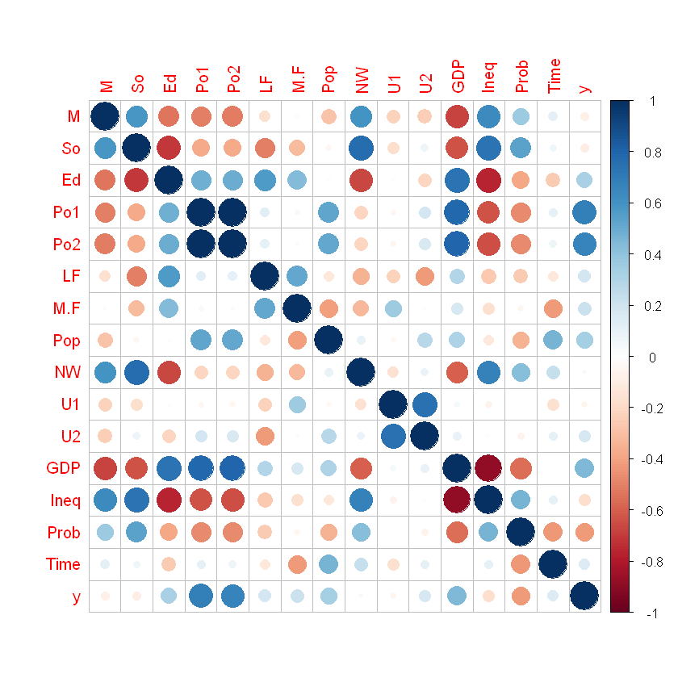
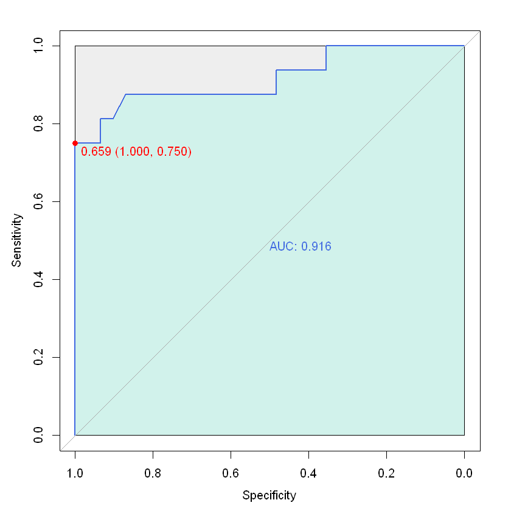
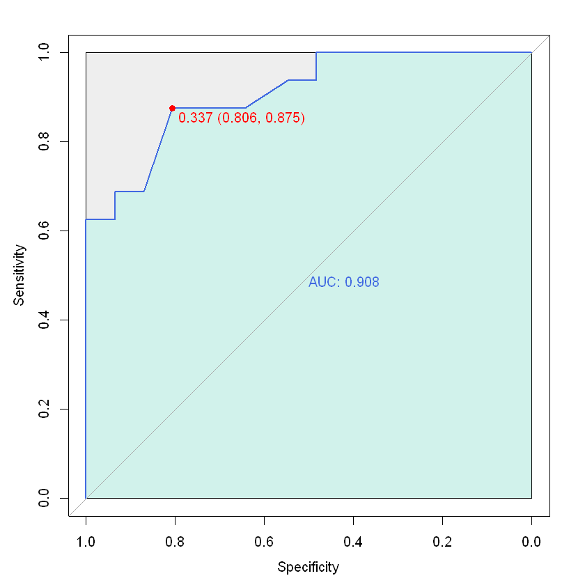
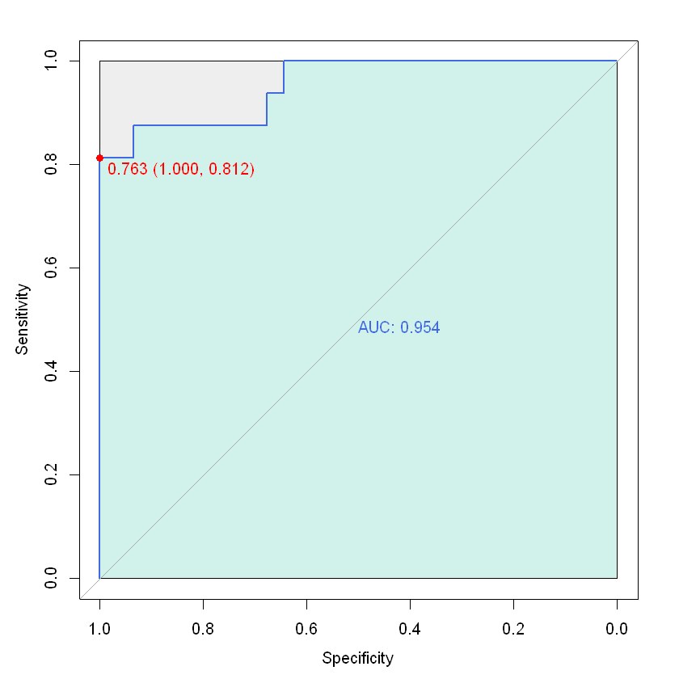
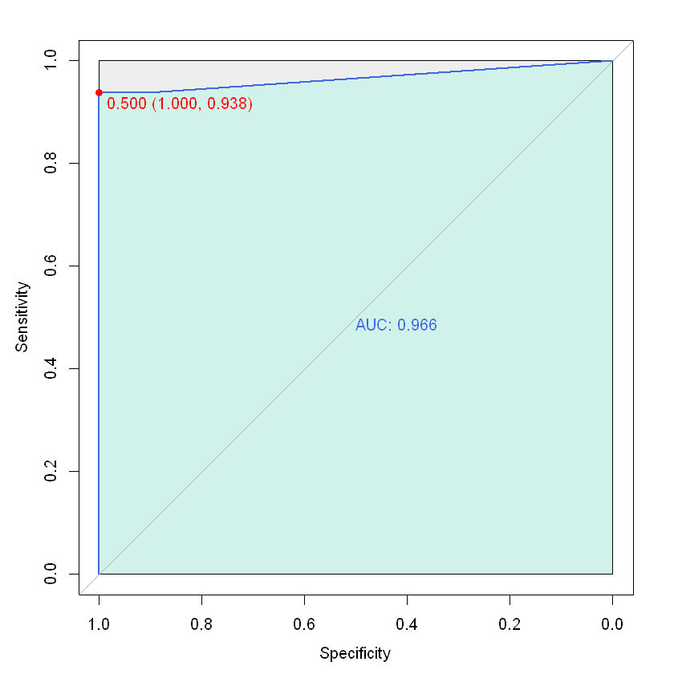
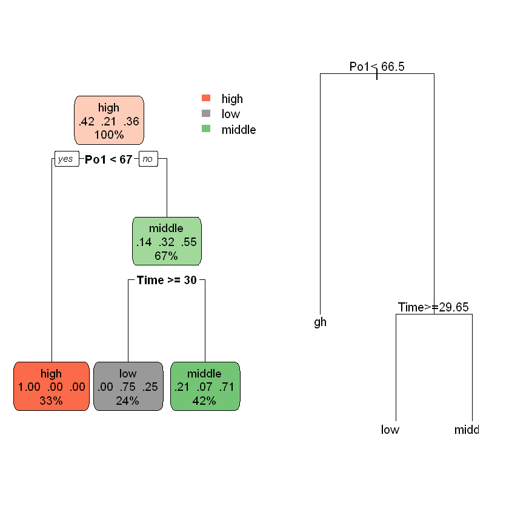
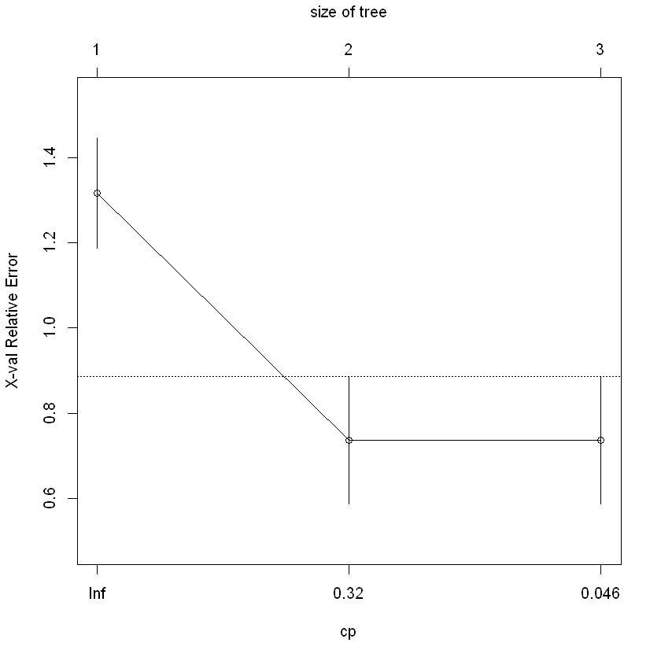

<center>
    <header> 2020.11 데이터분석과 R 중간고사</header>
     <pre>
     산업정보시스템공학과
    201510336 구경민
    </pre>
</center>

## 목차
<pre>
    1. 데이터 파악
    2. EDA & pre-processing
    3. Classification
        3.1 남부주 분류분석
            3.1.1 로지스틱회귀를 이용한 남부주 분류분석
            3.1.2 나이브베이즈를 이용한 남부주 분류분석
        3.2 구속률 수준 분류
            3.2.1 의사결정나무를 이용한 구속률 수준 분류
            3.2.2 KNN을 이용한 구속률 수준 분류
     4. 결론
</pre>

## 1. 데이터 파악


```R
# 라이브러리 로드
library(MASS)
library(dplyr)
library(caret)
library(ggplot2)
```

    Warning message:
    "package 'MASS' was built under R version 3.6.3"
    
    Attaching package: 'dplyr'
    
    
    The following object is masked from 'package:MASS':
    
        select
    
    
    The following objects are masked from 'package:stats':
    
        filter, lag
    
    
    The following objects are masked from 'package:base':
    
        intersect, setdiff, setequal, union
    
    
    Warning message:
    "package 'caret' was built under R version 3.6.3"
    Loading required package: lattice
    
    Loading required package: ggplot2
    
    Warning message:
    "package 'ggplot2' was built under R version 3.6.3"
    


```R
# 데이터 로드
crime <- as.data.frame(MASS::UScrime)

# View(crime)
str(crime)

```

    'data.frame':	47 obs. of  16 variables:
     $ M   : int  151 143 142 136 141 121 127 131 157 140 ...
     $ So  : int  1 0 1 0 0 0 1 1 1 0 ...
     $ Ed  : int  91 113 89 121 121 110 111 109 90 118 ...
     $ Po1 : int  58 103 45 149 109 118 82 115 65 71 ...
     $ Po2 : int  56 95 44 141 101 115 79 109 62 68 ...
     $ LF  : int  510 583 533 577 591 547 519 542 553 632 ...
     $ M.F : int  950 1012 969 994 985 964 982 969 955 1029 ...
     $ Pop : int  33 13 18 157 18 25 4 50 39 7 ...
     $ NW  : int  301 102 219 80 30 44 139 179 286 15 ...
     $ U1  : int  108 96 94 102 91 84 97 79 81 100 ...
     $ U2  : int  41 36 33 39 20 29 38 35 28 24 ...
     $ GDP : int  394 557 318 673 578 689 620 472 421 526 ...
     $ Ineq: int  261 194 250 167 174 126 168 206 239 174 ...
     $ Prob: num  0.0846 0.0296 0.0834 0.0158 0.0414 ...
     $ Time: num  26.2 25.3 24.3 29.9 21.3 ...
     $ y   : int  791 1635 578 1969 1234 682 963 1555 856 705 ...
    

<pre>
uscrime 데이터 
: 처벌정책이 범죄율에 미치는 영향 연구(미국 47개 주의 데이터)
M = 14-24살 남성인구 비율
So = 남부 주에 대한 지시변수
Ed = 평균 교육기간
Po1 = 1960년 경찰 유지비용
Po2 = 1959년 경찰 유지비용
LF = 고용률
M.F = 여성 1000명당 남성 비율
Pop = 주 인구수(단위 1000명)
NW = 인구 1000명당 비백인수
U1 = 14-24세 도시 남성 실업률
U2 = 35-39세 도시 남성 실업률 
GDP = 1인당 주내 총생산량
Ineq = 소득 불평등 지수
Prob = 구속 확률
Time = 재소자의 재소기간의 평균
y = 특정 유형에 대한 범죄율
</pre>

### 2. EDA & pre-processing
> EDA에서 상관분석을 행한다.상관분석을 하는 이유는 변수 간의 상관계수가 클수록(절댓값) 등분산성을 만족하기에 상관분석을 통해 등분산성을 만족하는 변수를 골라 분석에 사용한다.


```R
# 상관관계 분석
# install.packages("corrplot")
library(corrplot)
crime_cor <- cor(crime)
crime_cor
corrplot(crime_cor)
```

    Warning message:
    "package 'corrplot' was built under R version 3.6.3"
    corrplot 0.84 loaded
    
    


<table>
<caption>A matrix: 16 × 16 of type dbl</caption>
<thead>
	<tr><th></th><th scope=col>M</th><th scope=col>So</th><th scope=col>Ed</th><th scope=col>Po1</th><th scope=col>Po2</th><th scope=col>LF</th><th scope=col>M.F</th><th scope=col>Pop</th><th scope=col>NW</th><th scope=col>U1</th><th scope=col>U2</th><th scope=col>GDP</th><th scope=col>Ineq</th><th scope=col>Prob</th><th scope=col>Time</th><th scope=col>y</th></tr>
</thead>
<tbody>
	<tr><th scope=row>M</th><td> 1.00000000</td><td> 0.58435534</td><td>-0.53023964</td><td>-0.50573690</td><td>-0.51317336</td><td>-0.1609488</td><td>-0.02867993</td><td>-0.28063762</td><td> 0.59319826</td><td>-0.224380599</td><td>-0.24484339</td><td>-0.6700550558</td><td> 0.63921138</td><td> 0.361116408</td><td> 0.1145107190</td><td>-0.08947240</td></tr>
	<tr><th scope=row>So</th><td> 0.58435534</td><td> 1.00000000</td><td>-0.70274132</td><td>-0.37263633</td><td>-0.37616753</td><td>-0.5054695</td><td>-0.31473291</td><td>-0.04991832</td><td> 0.76710262</td><td>-0.172419305</td><td> 0.07169289</td><td>-0.6369454328</td><td> 0.73718106</td><td> 0.530861993</td><td> 0.0668128312</td><td>-0.09063696</td></tr>
	<tr><th scope=row>Ed</th><td>-0.53023964</td><td>-0.70274132</td><td> 1.00000000</td><td> 0.48295213</td><td> 0.49940958</td><td> 0.5611780</td><td> 0.43691492</td><td>-0.01722740</td><td>-0.66488190</td><td> 0.018103454</td><td>-0.21568155</td><td> 0.7359970363</td><td>-0.76865789</td><td>-0.389922862</td><td>-0.2539735471</td><td> 0.32283487</td></tr>
	<tr><th scope=row>Po1</th><td>-0.50573690</td><td>-0.37263633</td><td> 0.48295213</td><td> 1.00000000</td><td> 0.99358648</td><td> 0.1214932</td><td> 0.03376027</td><td> 0.52628358</td><td>-0.21370878</td><td>-0.043697608</td><td> 0.18509304</td><td> 0.7872252807</td><td>-0.63050025</td><td>-0.473247036</td><td> 0.1033577449</td><td> 0.68760446</td></tr>
	<tr><th scope=row>Po2</th><td>-0.51317336</td><td>-0.37616753</td><td> 0.49940958</td><td> 0.99358648</td><td> 1.00000000</td><td> 0.1063496</td><td> 0.02284250</td><td> 0.51378940</td><td>-0.21876821</td><td>-0.051711989</td><td> 0.16922422</td><td> 0.7942620503</td><td>-0.64815183</td><td>-0.473027293</td><td> 0.0756266536</td><td> 0.66671414</td></tr>
	<tr><th scope=row>LF</th><td>-0.16094882</td><td>-0.50546948</td><td> 0.56117795</td><td> 0.12149320</td><td> 0.10634960</td><td> 1.0000000</td><td> 0.51355879</td><td>-0.12367222</td><td>-0.34121444</td><td>-0.229399684</td><td>-0.42076249</td><td> 0.2946323090</td><td>-0.26988646</td><td>-0.250086098</td><td>-0.1236404364</td><td> 0.18886635</td></tr>
	<tr><th scope=row>M.F</th><td>-0.02867993</td><td>-0.31473291</td><td> 0.43691492</td><td> 0.03376027</td><td> 0.02284250</td><td> 0.5135588</td><td> 1.00000000</td><td>-0.41062750</td><td>-0.32730454</td><td> 0.351891900</td><td>-0.01869169</td><td> 0.1796086363</td><td>-0.16708869</td><td>-0.050858258</td><td>-0.4276973791</td><td> 0.21391426</td></tr>
	<tr><th scope=row>Pop</th><td>-0.28063762</td><td>-0.04991832</td><td>-0.01722740</td><td> 0.52628358</td><td> 0.51378940</td><td>-0.1236722</td><td>-0.41062750</td><td> 1.00000000</td><td> 0.09515301</td><td>-0.038119948</td><td> 0.27042159</td><td> 0.3082627091</td><td>-0.12629357</td><td>-0.347289063</td><td> 0.4642104596</td><td> 0.33747406</td></tr>
	<tr><th scope=row>NW</th><td> 0.59319826</td><td> 0.76710262</td><td>-0.66488190</td><td>-0.21370878</td><td>-0.21876821</td><td>-0.3412144</td><td>-0.32730454</td><td> 0.09515301</td><td> 1.00000000</td><td>-0.156450020</td><td> 0.08090829</td><td>-0.5901070652</td><td> 0.67731286</td><td> 0.428059153</td><td> 0.2303984071</td><td> 0.03259884</td></tr>
	<tr><th scope=row>U1</th><td>-0.22438060</td><td>-0.17241931</td><td> 0.01810345</td><td>-0.04369761</td><td>-0.05171199</td><td>-0.2293997</td><td> 0.35189190</td><td>-0.03811995</td><td>-0.15645002</td><td> 1.000000000</td><td> 0.74592482</td><td> 0.0448572017</td><td>-0.06383218</td><td>-0.007469032</td><td>-0.1698528383</td><td>-0.05047792</td></tr>
	<tr><th scope=row>U2</th><td>-0.24484339</td><td> 0.07169289</td><td>-0.21568155</td><td> 0.18509304</td><td> 0.16922422</td><td>-0.4207625</td><td>-0.01869169</td><td> 0.27042159</td><td> 0.08090829</td><td> 0.745924815</td><td> 1.00000000</td><td> 0.0920716601</td><td> 0.01567818</td><td>-0.061592474</td><td> 0.1013583270</td><td> 0.17732065</td></tr>
	<tr><th scope=row>GDP</th><td>-0.67005506</td><td>-0.63694543</td><td> 0.73599704</td><td> 0.78722528</td><td> 0.79426205</td><td> 0.2946323</td><td> 0.17960864</td><td> 0.30826271</td><td>-0.59010707</td><td> 0.044857202</td><td> 0.09207166</td><td> 1.0000000000</td><td>-0.88399728</td><td>-0.555334708</td><td> 0.0006485587</td><td> 0.44131995</td></tr>
	<tr><th scope=row>Ineq</th><td> 0.63921138</td><td> 0.73718106</td><td>-0.76865789</td><td>-0.63050025</td><td>-0.64815183</td><td>-0.2698865</td><td>-0.16708869</td><td>-0.12629357</td><td> 0.67731286</td><td>-0.063832178</td><td> 0.01567818</td><td>-0.8839972758</td><td> 1.00000000</td><td> 0.465321920</td><td> 0.1018228182</td><td>-0.17902373</td></tr>
	<tr><th scope=row>Prob</th><td> 0.36111641</td><td> 0.53086199</td><td>-0.38992286</td><td>-0.47324704</td><td>-0.47302729</td><td>-0.2500861</td><td>-0.05085826</td><td>-0.34728906</td><td> 0.42805915</td><td>-0.007469032</td><td>-0.06159247</td><td>-0.5553347075</td><td> 0.46532192</td><td> 1.000000000</td><td>-0.4362462614</td><td>-0.42742219</td></tr>
	<tr><th scope=row>Time</th><td> 0.11451072</td><td> 0.06681283</td><td>-0.25397355</td><td> 0.10335774</td><td> 0.07562665</td><td>-0.1236404</td><td>-0.42769738</td><td> 0.46421046</td><td> 0.23039841</td><td>-0.169852838</td><td> 0.10135833</td><td> 0.0006485587</td><td> 0.10182282</td><td>-0.436246261</td><td> 1.0000000000</td><td> 0.14986606</td></tr>
	<tr><th scope=row>y</th><td>-0.08947240</td><td>-0.09063696</td><td> 0.32283487</td><td> 0.68760446</td><td> 0.66671414</td><td> 0.1888663</td><td> 0.21391426</td><td> 0.33747406</td><td> 0.03259884</td><td>-0.050477918</td><td> 0.17732065</td><td> 0.4413199490</td><td>-0.17902373</td><td>-0.427422188</td><td> 0.1498660617</td><td> 1.00000000</td></tr>
</tbody>
</table>





## 3. Classification

### 3.1.1  로지스틱회귀를 이용한 소득불평등, 평균교육, 비백인수에 대한 남부주 분류분석
<pre>
상관분석을 통해 so와 강한 상관관계를 가지는 변수를 알아봤다.
so와 강한상관관계를 가지는 소득불평등지수(Ineq), 평균교육(ed), 비백인수(NW) 등을 사용하여 로지스틱회귀를 통해 분류분석을 시행했다. 
로지스틱 회귀를 사용하는 이유는 종속변수 So가 이진변수여서 로지스틱을 사용하였다.
</pre>

먼저 변수so를 factor 형으로 변환하고 관련 데이터만 추출 후 학습데이터와 테스트데이터를 7:3으로 나눈다.
7:3으로 나누는 이유는 레코드가 47개라서 나누기 힘드므로 가장 많이 사용하는 방법을 따라 사용한다.


```R
# 데이터 복사
so_crime <- crime

# so를 factor형으로 변환
so_crime$So <-as.factor(so_crime$So)
head(so_crime)
str(so_crime)

# 관련데이터만 추출
logi_subset <- so_crime  %>% 
    select(So, Ed, NW, Ineq)

# partition to train and test
set.seed(71)
logi_train <- sample_frac(logi_subset, size = 0.7)
logi_test <- logi_subset[setdiff(x=1:nrow(logi_subset), y=logi_train),]
print(head(logi_train))
print(head(logi_test))
```


<table>
<caption>A data.frame: 6 × 16</caption>
<thead>
	<tr><th></th><th scope=col>M</th><th scope=col>So</th><th scope=col>Ed</th><th scope=col>Po1</th><th scope=col>Po2</th><th scope=col>LF</th><th scope=col>M.F</th><th scope=col>Pop</th><th scope=col>NW</th><th scope=col>U1</th><th scope=col>U2</th><th scope=col>GDP</th><th scope=col>Ineq</th><th scope=col>Prob</th><th scope=col>Time</th><th scope=col>y</th></tr>
	<tr><th></th><th scope=col>&lt;int&gt;</th><th scope=col>&lt;fct&gt;</th><th scope=col>&lt;int&gt;</th><th scope=col>&lt;int&gt;</th><th scope=col>&lt;int&gt;</th><th scope=col>&lt;int&gt;</th><th scope=col>&lt;int&gt;</th><th scope=col>&lt;int&gt;</th><th scope=col>&lt;int&gt;</th><th scope=col>&lt;int&gt;</th><th scope=col>&lt;int&gt;</th><th scope=col>&lt;int&gt;</th><th scope=col>&lt;int&gt;</th><th scope=col>&lt;dbl&gt;</th><th scope=col>&lt;dbl&gt;</th><th scope=col>&lt;int&gt;</th></tr>
</thead>
<tbody>
	<tr><th scope=row>1</th><td>151</td><td>1</td><td> 91</td><td> 58</td><td> 56</td><td>510</td><td> 950</td><td> 33</td><td>301</td><td>108</td><td>41</td><td>394</td><td>261</td><td>0.084602</td><td>26.2011</td><td> 791</td></tr>
	<tr><th scope=row>2</th><td>143</td><td>0</td><td>113</td><td>103</td><td> 95</td><td>583</td><td>1012</td><td> 13</td><td>102</td><td> 96</td><td>36</td><td>557</td><td>194</td><td>0.029599</td><td>25.2999</td><td>1635</td></tr>
	<tr><th scope=row>3</th><td>142</td><td>1</td><td> 89</td><td> 45</td><td> 44</td><td>533</td><td> 969</td><td> 18</td><td>219</td><td> 94</td><td>33</td><td>318</td><td>250</td><td>0.083401</td><td>24.3006</td><td> 578</td></tr>
	<tr><th scope=row>4</th><td>136</td><td>0</td><td>121</td><td>149</td><td>141</td><td>577</td><td> 994</td><td>157</td><td> 80</td><td>102</td><td>39</td><td>673</td><td>167</td><td>0.015801</td><td>29.9012</td><td>1969</td></tr>
	<tr><th scope=row>5</th><td>141</td><td>0</td><td>121</td><td>109</td><td>101</td><td>591</td><td> 985</td><td> 18</td><td> 30</td><td> 91</td><td>20</td><td>578</td><td>174</td><td>0.041399</td><td>21.2998</td><td>1234</td></tr>
	<tr><th scope=row>6</th><td>121</td><td>0</td><td>110</td><td>118</td><td>115</td><td>547</td><td> 964</td><td> 25</td><td> 44</td><td> 84</td><td>29</td><td>689</td><td>126</td><td>0.034201</td><td>20.9995</td><td> 682</td></tr>
</tbody>
</table>


    'data.frame':	47 obs. of  16 variables:
     $ M   : int  151 143 142 136 141 121 127 131 157 140 ...
     $ So  : Factor w/ 2 levels "0","1": 2 1 2 1 1 1 2 2 2 1 ...
     $ Ed  : int  91 113 89 121 121 110 111 109 90 118 ...
     $ Po1 : int  58 103 45 149 109 118 82 115 65 71 ...
     $ Po2 : int  56 95 44 141 101 115 79 109 62 68 ...
     $ LF  : int  510 583 533 577 591 547 519 542 553 632 ...
     $ M.F : int  950 1012 969 994 985 964 982 969 955 1029 ...
     $ Pop : int  33 13 18 157 18 25 4 50 39 7 ...
     $ NW  : int  301 102 219 80 30 44 139 179 286 15 ...
     $ U1  : int  108 96 94 102 91 84 97 79 81 100 ...
     $ U2  : int  41 36 33 39 20 29 38 35 28 24 ...
     $ GDP : int  394 557 318 673 578 689 620 472 421 526 ...
     $ Ineq: int  261 194 250 167 174 126 168 206 239 174 ...
     $ Prob: num  0.0846 0.0296 0.0834 0.0158 0.0414 ...
     $ Time: num  26.2 25.3 24.3 29.9 21.3 ...
     $ y   : int  791 1635 578 1969 1234 682 963 1555 856 705 ...
      So  Ed  NW Ineq
    1  0 112  79  215
    2  1  87  72  264
    3  1  91 301  261
    4  1  88 165  251
    5  1 109 179  206
    6  0 108  59  172
      So  Ed  NW Ineq
    1  1  91 301  261
    2  0 113 102  194
    3  1  89 219  250
    4  0 121  80  167
    5  0 121  30  174
    6  0 110  44  126
    


```R
so_logistic_Ineq <- glm(So~Ineq, data=logi_train, family = binomial)
summary(so_logistic_Ineq)
```


    
    Call:
    glm(formula = So ~ Ineq, family = binomial, data = logi_train)
    
    Deviance Residuals: 
        Min       1Q   Median       3Q      Max  
    -1.4563  -0.4955  -0.3052   0.5418   2.2665  
    
    Coefficients:
                 Estimate Std. Error z value Pr(>|z|)   
    (Intercept) -10.80268    3.35630  -3.219  0.00129 **
    Ineq          0.05039    0.01600   3.149  0.00164 **
    ---
    Signif. codes:  0 '***' 0.001 '**' 0.01 '*' 0.05 '.' 0.1 ' ' 1
    
    (Dispersion parameter for binomial family taken to be 1)
    
        Null deviance: 43.262  on 32  degrees of freedom
    Residual deviance: 25.659  on 31  degrees of freedom
    AIC: 29.659
    
    Number of Fisher Scoring iterations: 5
    


먼저 Ineq의 p값은 0.00164로 유의하다.


```R
# 오즈비
print(exp(so_logistic_Ineq$coefficients))
# 오즈비의 95% 신뢰구간
print(exp(confint(so_logistic_Ineq)))
# 분산분석(카이제곱)
anova(so_logistic_Ineq, test = "Chisq")
```

     (Intercept)         Ineq 
    2.034494e-05 1.051678e+00 
    

    Waiting for profiling to be done...
    
    

                       2.5 %      97.5 %
    (Intercept) 6.143065e-09 0.005275104
    Ineq        1.023955e+00 1.092727853
    


<table>
<caption>A anova: 2 × 5</caption>
<thead>
	<tr><th></th><th scope=col>Df</th><th scope=col>Deviance</th><th scope=col>Resid. Df</th><th scope=col>Resid. Dev</th><th scope=col>Pr(&gt;Chi)</th></tr>
	<tr><th></th><th scope=col>&lt;int&gt;</th><th scope=col>&lt;dbl&gt;</th><th scope=col>&lt;int&gt;</th><th scope=col>&lt;dbl&gt;</th><th scope=col>&lt;dbl&gt;</th></tr>
</thead>
<tbody>
	<tr><th scope=row>NULL</th><td>NA</td><td>      NA</td><td>32</td><td>43.26180</td><td>         NA</td></tr>
	<tr><th scope=row>Ineq</th><td> 1</td><td>17.60326</td><td>31</td><td>25.65854</td><td>2.72122e-05</td></tr>
</tbody>
</table>


오즈비와 카이제곱을 봤을 때 유의수준 0.05보다 아래의 값 즉 0과 가까운 값이 나오기에 모델이 유의하다.


```R
library(pROC)
Pro_Ineq = predict(so_logistic_Ineq, newdata = logi_test, type = 'response')
ROC = roc(logi_subset$So,Pro_Ineq)

plot.roc(ROC,   
        col="royalblue",  
        print.auc=TRUE, 
        max.auc.polygon=TRUE,   
        print.thres=TRUE, print.thres.pch=19, print.thres.col = "red",
        auc.polygon=TRUE, auc.polygon.col="#D1F2EB")
```

    Warning message:
    "package 'pROC' was built under R version 3.6.3"
    Type 'citation("pROC")' for a citation.
    
    
    Attaching package: 'pROC'
    
    
    The following objects are masked from 'package:stats':
    
        cov, smooth, var
    
    
    Setting levels: control = 0, case = 1
    
    Setting direction: controls < cases
    
    





ROC곡선을 만들어 성능분석을 했을 때 AUC가 0.916으로 성능이 좋은 것으로 나타난다.


```R
so_logistic_Ed <- glm(So~Ed, data=logi_train, family = binomial)
summary(so_logistic_Ed)
```


    
    Call:
    glm(formula = So ~ Ed, family = binomial, data = logi_train)
    
    Deviance Residuals: 
        Min       1Q   Median       3Q      Max  
    -1.6176  -0.6731  -0.2908   0.4224   2.0455  
    
    Coefficients:
                Estimate Std. Error z value Pr(>|z|)   
    (Intercept) 19.89656    6.96986   2.855  0.00431 **
    Ed          -0.19691    0.06691  -2.943  0.00325 **
    ---
    Signif. codes:  0 '***' 0.001 '**' 0.01 '*' 0.05 '.' 0.1 ' ' 1
    
    (Dispersion parameter for binomial family taken to be 1)
    
        Null deviance: 43.262  on 32  degrees of freedom
    Residual deviance: 26.108  on 31  degrees of freedom
    AIC: 30.108
    
    Number of Fisher Scoring iterations: 5
    


ed의 계수가 유의수준 보다 낮으므로 사용가능하다.


```R
# 오즈비
print(exp(so_logistic_Ed$coefficients))
# 오즈비의 95% 신뢰구간
print(exp(confint(so_logistic_Ed)))
# 분산분석(카이제곱)
anova(so_logistic_Ed, test = "Chisq")
```

     (Intercept)           Ed 
    4.374898e+08 8.212652e-01 
    

    Waiting for profiling to be done...
    
    

                      2.5 %       97.5 %
    (Intercept) 6020.129631 2.120635e+16
    Ed             0.693437 9.146912e-01
    


<table>
<caption>A anova: 2 × 5</caption>
<thead>
	<tr><th></th><th scope=col>Df</th><th scope=col>Deviance</th><th scope=col>Resid. Df</th><th scope=col>Resid. Dev</th><th scope=col>Pr(&gt;Chi)</th></tr>
	<tr><th></th><th scope=col>&lt;int&gt;</th><th scope=col>&lt;dbl&gt;</th><th scope=col>&lt;int&gt;</th><th scope=col>&lt;dbl&gt;</th><th scope=col>&lt;dbl&gt;</th></tr>
</thead>
<tbody>
	<tr><th scope=row>NULL</th><td>NA</td><td>     NA</td><td>32</td><td>43.2618</td><td>          NA</td></tr>
	<tr><th scope=row>Ed</th><td> 1</td><td>17.1533</td><td>31</td><td>26.1085</td><td>3.448099e-05</td></tr>
</tbody>
</table>


오즈비와 카이제곱을 구했을 때 p값이 0보다 아래의 값이 나오기에 사용가능하다.


```R
Pro_Ed = predict(so_logistic_Ed, newdata = logi_test, type = 'response')
ROC = roc(logi_subset$So,Pro_Ed)

plot.roc(ROC,   
        col="royalblue",  
        print.auc=TRUE, 
        max.auc.polygon=TRUE,   
        print.thres=TRUE, print.thres.pch=19, print.thres.col = "red",
        auc.polygon=TRUE, auc.polygon.col="#D1F2EB")
```

    Setting levels: control = 0, case = 1
    
    Setting direction: controls < cases
    
    





ROC를 이용하여 성능검정 했을 때 AUC가 0.908로 좋은 성능이 나오지만 앞서 Ineq보다 성능이 낮다.


```R
so_logistic_NW <- glm(So~NW, data=logi_train, family = binomial)
summary(so_logistic_NW)
```


    
    Call:
    glm(formula = So ~ NW, family = binomial, data = logi_train)
    
    Deviance Residuals: 
         Min        1Q    Median        3Q       Max  
    -0.97858  -0.14811  -0.04054   0.00222   2.20126  
    
    Coefficients:
                Estimate Std. Error z value Pr(>|z|)  
    (Intercept) -8.35964    4.10245  -2.038   0.0416 *
    NW           0.08375    0.04529   1.849   0.0644 .
    ---
    Signif. codes:  0 '***' 0.001 '**' 0.01 '*' 0.05 '.' 0.1 ' ' 1
    
    (Dispersion parameter for binomial family taken to be 1)
    
        Null deviance: 43.262  on 32  degrees of freedom
    Residual deviance: 10.841  on 31  degrees of freedom
    AIC: 14.841
    
    Number of Fisher Scoring iterations: 9
    


NW의 P값이 유의수준 보다 낮아 유의하다.


```R
# 오즈비
print(exp(so_logistic_NW$coefficients))
# 오즈비의 95% 신뢰구간
print(exp(confint(so_logistic_NW)))
# 분산분석(카이제곱)
anova(so_logistic_NW, test = "Chisq")
```

     (Intercept)           NW 
    0.0002341293 1.0873527015 
    

    Waiting for profiling to be done...
    
    Warning message:
    "glm.fit: fitted probabilities numerically 0 or 1 occurred"
    Warning message:
    "glm.fit: fitted probabilities numerically 0 or 1 occurred"
    Warning message:
    "glm.fit: fitted probabilities numerically 0 or 1 occurred"
    Warning message:
    "glm.fit: fitted probabilities numerically 0 or 1 occurred"
    Warning message:
    "glm.fit: fitted probabilities numerically 0 or 1 occurred"
    Warning message:
    "glm.fit: fitted probabilities numerically 0 or 1 occurred"
    Warning message:
    "glm.fit: fitted probabilities numerically 0 or 1 occurred"
    Warning message:
    "glm.fit: fitted probabilities numerically 0 or 1 occurred"
    Warning message:
    "glm.fit: fitted probabilities numerically 0 or 1 occurred"
    Warning message:
    "glm.fit: fitted probabilities numerically 0 or 1 occurred"
    Warning message:
    "glm.fit: fitted probabilities numerically 0 or 1 occurred"
    Warning message:
    "glm.fit: fitted probabilities numerically 0 or 1 occurred"
    Warning message:
    "glm.fit: fitted probabilities numerically 0 or 1 occurred"
    Warning message:
    "glm.fit: fitted probabilities numerically 0 or 1 occurred"
    Warning message:
    "glm.fit: fitted probabilities numerically 0 or 1 occurred"
    Warning message:
    "glm.fit: fitted probabilities numerically 0 or 1 occurred"
    Warning message:
    "glm.fit: fitted probabilities numerically 0 or 1 occurred"
    Warning message:
    "glm.fit: fitted probabilities numerically 0 or 1 occurred"
    

                       2.5 %     97.5 %
    (Intercept) 2.353050e-10 0.03286327
    NW          1.031567e+00 1.26739073
    


<table>
<caption>A anova: 2 × 5</caption>
<thead>
	<tr><th></th><th scope=col>Df</th><th scope=col>Deviance</th><th scope=col>Resid. Df</th><th scope=col>Resid. Dev</th><th scope=col>Pr(&gt;Chi)</th></tr>
	<tr><th></th><th scope=col>&lt;int&gt;</th><th scope=col>&lt;dbl&gt;</th><th scope=col>&lt;int&gt;</th><th scope=col>&lt;dbl&gt;</th><th scope=col>&lt;dbl&gt;</th></tr>
</thead>
<tbody>
	<tr><th scope=row>NULL</th><td>NA</td><td>     NA</td><td>32</td><td>43.2618</td><td>          NA</td></tr>
	<tr><th scope=row>NW</th><td> 1</td><td>32.4205</td><td>31</td><td>10.8413</td><td>1.241699e-08</td></tr>
</tbody>
</table>


오즈비와 카이제곱을 계산 했을 때 카이제곱의 P값이 0에 가까운 수가 나오므로 사용가능하다.


```R
Pro_NW = predict(so_logistic_NW, newdata = logi_test, type = 'response')
ROC = roc(logi_subset$So,Pro_NW)

plot.roc(ROC,   
        col="royalblue",  
        print.auc=TRUE, 
        max.auc.polygon=TRUE,   
        print.thres=TRUE, print.thres.pch=19, print.thres.col = "red",
        auc.polygon=TRUE, auc.polygon.col="#D1F2EB")
```

    Setting levels: control = 0, case = 1
    
    Setting direction: controls < cases
    
    





ROC의 AUC가 0.954로 지금까지의 모델 중에 가장 성능이 우수하다.


```R
so_logistic_multi <- glm(So~Ineq+Ed+NW, data=logi_train, family=binomial)
summary(so_logistic_multi)
```

    Warning message:
    "glm.fit: algorithm did not converge"
    Warning message:
    "glm.fit: fitted probabilities numerically 0 or 1 occurred"
    


    
    Call:
    glm(formula = So ~ Ineq + Ed + NW, family = binomial, data = logi_train)
    
    Deviance Residuals: 
           Min          1Q      Median          3Q         Max  
    -1.452e-04  -2.100e-08  -2.100e-08   2.100e-08   1.266e-04  
    
    Coefficients:
                  Estimate Std. Error z value Pr(>|z|)
    (Intercept) -2.930e+03  3.418e+06  -0.001    0.999
    Ineq         6.489e+00  5.399e+03   0.001    0.999
    Ed           9.237e+00  2.370e+04   0.000    1.000
    NW           5.997e+00  1.626e+03   0.004    0.997
    
    (Dispersion parameter for binomial family taken to be 1)
    
        Null deviance: 4.3262e+01  on 32  degrees of freedom
    Residual deviance: 4.6218e-08  on 29  degrees of freedom
    AIC: 8
    
    Number of Fisher Scoring iterations: 25
    


다중 로지스틱을 행했을 때 모든 계수가 0.05를 넘었으므로 유의하지 않다.


```R
# 오즈비
print(exp(so_logistic_multi$coefficients))
# 오즈비의 95% 신뢰구간
print(exp(confint(so_logistic_multi)))
# 분산분석(카이제곱)
anova(so_logistic_multi, test = "Chisq")
```

    (Intercept)        Ineq          Ed          NW 
         0.0000    657.6772  10274.4291    402.1373 
    

    Waiting for profiling to be done...
    
    Warning message:
    "glm.fit: fitted probabilities numerically 0 or 1 occurred"
    Warning message:
    "glm.fit: fitted probabilities numerically 0 or 1 occurred"
    Warning message:
    "glm.fit: fitted probabilities numerically 0 or 1 occurred"
    Warning message:
    "glm.fit: fitted probabilities numerically 0 or 1 occurred"
    Warning message:
    "glm.fit: fitted probabilities numerically 0 or 1 occurred"
    Warning message:
    "glm.fit: fitted probabilities numerically 0 or 1 occurred"
    Warning message:
    "glm.fit: fitted probabilities numerically 0 or 1 occurred"
    Warning message:
    "glm.fit: fitted probabilities numerically 0 or 1 occurred"
    

                        2.5 %        97.5 %
    (Intercept)  0.000000e+00           Inf
    Ineq        4.343569e-189 9.958153e+193
    Ed           0.000000e+00           Inf
    NW           2.313835e-29  5.326155e+35
    


<table>
<caption>A anova: 4 × 5</caption>
<thead>
	<tr><th></th><th scope=col>Df</th><th scope=col>Deviance</th><th scope=col>Resid. Df</th><th scope=col>Resid. Dev</th><th scope=col>Pr(&gt;Chi)</th></tr>
	<tr><th></th><th scope=col>&lt;int&gt;</th><th scope=col>&lt;dbl&gt;</th><th scope=col>&lt;int&gt;</th><th scope=col>&lt;dbl&gt;</th><th scope=col>&lt;dbl&gt;</th></tr>
</thead>
<tbody>
	<tr><th scope=row>NULL</th><td>NA</td><td>       NA</td><td>32</td><td>4.326180e+01</td><td>          NA</td></tr>
	<tr><th scope=row>Ineq</th><td> 1</td><td>17.603256</td><td>31</td><td>2.565854e+01</td><td>2.721220e-05</td></tr>
	<tr><th scope=row>Ed</th><td> 1</td><td> 2.486554</td><td>30</td><td>2.317199e+01</td><td>1.148229e-01</td></tr>
	<tr><th scope=row>NW</th><td> 1</td><td>23.171986</td><td>29</td><td>4.621759e-08</td><td>1.481397e-06</td></tr>
</tbody>
</table>


오즈비와 카이제곱을 계산한 결과 카이제곱 P값이 0과 가까운 수가 나왔지만 앞서 분석에서 사용할 수 없기에 이 모델은 사용할 수 없다. 


```R
Pro_multi = predict(so_logistic_multi, newdata = logi_test, type = 'response')
ROC = roc(logi_subset$So,Pro_multi)

plot.roc(ROC,   
        col="royalblue",  
        print.auc=TRUE, 
        max.auc.polygon=TRUE,   
        print.thres=TRUE, print.thres.pch=19, print.thres.col = "red",
        auc.polygon=TRUE, auc.polygon.col="#D1F2EB")
```

    Setting levels: control = 0, case = 1
    
    Setting direction: controls < cases
    
    





지금까지 모델 중 가장 성능이 우수하게 나왔지만 P값이 0.05를 넘었으므로 사용할 수 없는 모델이다.

### 3.1.2 단순베이즈분류를 이용한 남부주 분류

단순베이즈분류는 확률에 의거하여 사후확률에 의해 분류한다. 이진변수 So를 분류하는 모델을 만들어 보았다.


```R
library(e1071)

str(so_crime)

set.seed(71)
ba_train <- sample_frac(so_crime, size = 0.7)
ba_test <- logi_subset[setdiff(x=1:nrow(so_crime), y=ba_train),]
print(head(ba_train))
print(head(ba_test))
```

    Warning message:
    "package 'e1071' was built under R version 3.6.3"
    

    'data.frame':	47 obs. of  16 variables:
     $ M   : int  151 143 142 136 141 121 127 131 157 140 ...
     $ So  : Factor w/ 2 levels "0","1": 2 1 2 1 1 1 2 2 2 1 ...
     $ Ed  : int  91 113 89 121 121 110 111 109 90 118 ...
     $ Po1 : int  58 103 45 149 109 118 82 115 65 71 ...
     $ Po2 : int  56 95 44 141 101 115 79 109 62 68 ...
     $ LF  : int  510 583 533 577 591 547 519 542 553 632 ...
     $ M.F : int  950 1012 969 994 985 964 982 969 955 1029 ...
     $ Pop : int  33 13 18 157 18 25 4 50 39 7 ...
     $ NW  : int  301 102 219 80 30 44 139 179 286 15 ...
     $ U1  : int  108 96 94 102 91 84 97 79 81 100 ...
     $ U2  : int  41 36 33 39 20 29 38 35 28 24 ...
     $ GDP : int  394 557 318 673 578 689 620 472 421 526 ...
     $ Ineq: int  261 194 250 167 174 126 168 206 239 174 ...
     $ Prob: num  0.0846 0.0296 0.0834 0.0158 0.0414 ...
     $ Time: num  26.2 25.3 24.3 29.9 21.3 ...
     $ y   : int  791 1635 578 1969 1234 682 963 1555 856 705 ...
        M So  Ed Po1 Po2  LF  M.F Pop  NW  U1 U2 GDP Ineq     Prob    Time    y
    1 152  0 112  82  76 571 1018  10  79 103 28 537  215 0.038201 25.8006 1216
    2 152  1  87  57  53 530  986  30  72  92 43 405  264 0.069100 22.7008  798
    3 151  1  91  58  56 510  950  33 301 108 41 394  261 0.084602 26.2011  791
    4 149  1  88  61  54 515  953  36 165  86 35 395  251 0.047099 27.3004  826
    5 131  1 109 115 109 542  969  50 179  79 35 472  206 0.040099 24.5988 1555
    6 134  0 108  75  71 595  972  47  59  83 31 580  172 0.031201 34.2984  849
      So  Ed  NW Ineq
    1  1  91 301  261
    2  0 113 102  194
    3  1  89 219  250
    4  0 121  80  167
    5  0 121  30  174
    6  0 110  44  126
    


```R
so_ba <- naiveBayes(So~., data=ba_train)
summary(so_ba)
so_ba_pre <- predict(so_ba, newdata = ba_test) # 예측값
so_ba_pre_ta <- table(so_ba_pre, so_crime$So) # 정오분류표
so_ba_pre_ta
table(so_crime$So)
```


              Length Class  Mode     
    apriori    2     table  numeric  
    tables    15     -none- list     
    levels     2     -none- character
    isnumeric 15     -none- logical  
    call       4     -none- call     


    Warning message in predict.naiveBayes(so_ba, newdata = ba_test):
    "Type mismatch between training and new data for variable 'M'. Did you use factors with numeric labels for training, and numeric values for new data?"
    Warning message in predict.naiveBayes(so_ba, newdata = ba_test):
    "Type mismatch between training and new data for variable 'Po1'. Did you use factors with numeric labels for training, and numeric values for new data?"
    Warning message in predict.naiveBayes(so_ba, newdata = ba_test):
    "Type mismatch between training and new data for variable 'Po2'. Did you use factors with numeric labels for training, and numeric values for new data?"
    Warning message in predict.naiveBayes(so_ba, newdata = ba_test):
    "Type mismatch between training and new data for variable 'LF'. Did you use factors with numeric labels for training, and numeric values for new data?"
    Warning message in predict.naiveBayes(so_ba, newdata = ba_test):
    "Type mismatch between training and new data for variable 'M.F'. Did you use factors with numeric labels for training, and numeric values for new data?"
    Warning message in predict.naiveBayes(so_ba, newdata = ba_test):
    "Type mismatch between training and new data for variable 'Pop'. Did you use factors with numeric labels for training, and numeric values for new data?"
    Warning message in predict.naiveBayes(so_ba, newdata = ba_test):
    "Type mismatch between training and new data for variable 'U1'. Did you use factors with numeric labels for training, and numeric values for new data?"
    Warning message in predict.naiveBayes(so_ba, newdata = ba_test):
    "Type mismatch between training and new data for variable 'U2'. Did you use factors with numeric labels for training, and numeric values for new data?"
    Warning message in predict.naiveBayes(so_ba, newdata = ba_test):
    "Type mismatch between training and new data for variable 'GDP'. Did you use factors with numeric labels for training, and numeric values for new data?"
    Warning message in predict.naiveBayes(so_ba, newdata = ba_test):
    "Type mismatch between training and new data for variable 'Prob'. Did you use factors with numeric labels for training, and numeric values for new data?"
    Warning message in predict.naiveBayes(so_ba, newdata = ba_test):
    "Type mismatch between training and new data for variable 'Time'. Did you use factors with numeric labels for training, and numeric values for new data?"
    Warning message in predict.naiveBayes(so_ba, newdata = ba_test):
    "Type mismatch between training and new data for variable 'y'. Did you use factors with numeric labels for training, and numeric values for new data?"
    


             
    so_ba_pre  0  1
            0 30  1
            1  1 15


    
     0  1 
    31 16 


정분류표를 뽑았을 떄 0과 1이 나눠진 것을 볼 수 있다.

### 3.2 구속률 수준 분류

### 3.2.1 의사결정나무를 이용한 구속률 수준 분류


```R
# 데이터 복사
des_c <- crime
summary(des_c$Prob)

des_c <- des_c  %>% 
    mutate(Prob_levels = ifelse(Prob< 0.03270,'low', #1Q 미만까지 LOW
                                ifelse(Prob<0.04709, 'middle', 'high'))) # 평균 미만까지 중간 그 외 높음
des_c$Prob_levels <- as.factor(des_c$Prob_levels)

des_c <- subset(des_c, select = -c(Prob,So))

# partition to train and test
set.seed(71) # 랜덤으로 추출하기 때문에 seed값을 지정해준다.
des_train <- sample_frac(des_c, size = 0.7)
des_test <- des_c[setdiff(x=1:nrow(des_c), y=des_train),]
print(head(des_train))
print(head(des_test))
```


       Min. 1st Qu.  Median    Mean 3rd Qu.    Max. 
    0.00690 0.03270 0.04210 0.04709 0.05445 0.11980 


        M  Ed Po1 Po2  LF  M.F Pop  NW  U1 U2 GDP Ineq    Time    y Prob_levels
    1 152 112  82  76 571 1018  10  79 103 28 537  215 25.8006 1216      middle
    2 152  87  57  53 530  986  30  72  92 43 405  264 22.7008  798        high
    3 151  91  58  56 510  950  33 301 108 41 394  261 26.2011  791        high
    4 149  88  61  54 515  953  36 165  86 35 395  251 27.3004  826        high
    5 131 109 115 109 542  969  50 179  79 35 472  206 24.5988 1555      middle
    6 134 108  75  71 595  972  47  59  83 31 580  172 34.2984  849         low
        M  Ed Po1 Po2  LF  M.F Pop  NW  U1 U2 GDP Ineq    Time    y Prob_levels
    1 151  91  58  56 510  950  33 301 108 41 394  261 26.2011  791        high
    2 143 113 103  95 583 1012  13 102  96 36 557  194 25.2999 1635         low
    3 142  89  45  44 533  969  18 219  94 33 318  250 24.3006  578        high
    4 136 121 149 141 577  994 157  80 102 39 673  167 29.9012 1969         low
    5 141 121 109 101 591  985  18  30  91 20 578  174 21.2998 1234      middle
    6 121 110 118 115 547  964  25  44  84 29 689  126 20.9995  682      middle
    

전과 마찬가지로 데이터를 복사하고 구간화를 들어갔다. 개인적으로 3개의 구간화하는게 좋을 것 같아 사분위수 기준으로 3개로 나눴다. 그리고 학습데이터와 테스트데이터를 나누고 모델링에 들어갔다.


```R
# install.packages("rpart")
library(rpart)

dt_fit <- rpart(Prob_levels~., data=des_train)
dt_fit

library(rpart.plot); par(mfrow=c(1,2))
rpart.plot(dt_fit) ; plot(dt_fit) ; text(dt_fit)
```


    n= 33 
    
    node), split, n, loss, yval, (yprob)
          * denotes terminal node
    
    1) root 33 19 high (0.42424242 0.21212121 0.36363636)  
      2) Po1< 66.5 11  0 high (1.00000000 0.00000000 0.00000000) *
      3) Po1>=66.5 22 10 middle (0.13636364 0.31818182 0.54545455)  
        6) Time>=29.65025 8  2 low (0.00000000 0.75000000 0.25000000) *
        7) Time< 29.65025 14  4 middle (0.21428571 0.07142857 0.71428571) *


    Warning message:
    "package 'rpart.plot' was built under R version 3.6.3"
    





분류모델을 만들었을 때 위와 같은 분류그림이 나왔다. 개인적으로 적당한 그림이 나온 것 같지만, 그래도 성능분석과 plunning을 시행해보기로 했다.


```R
# 예측력 확인
dt_pre <- predict(dt_fit, newdata = des_test, type="class")
dt_test <- sum(dt_pre==des_test$Prob_levels)/nrow(des_test)*100
print("validation model prediction")
print(dt_test)

# 과적합 확인
dt_ov <- predict(dt_fit, newdata = des_train, type='class')
dt_ov_val <- sum(dt_pre==des_test$Prob_levels)/nrow(des_test)*100
print("validation model overfitting")
print(dt_ov_val)

# 복잡성 확인
print("cptable")
print(dt_fit$cptable)
plotcp(dt_fit) 

# 모델 정보
print(dt_fit$control)
```

    [1] "validation model prediction"
    [1] 76.59574
    [1] "validation model overfitting"
    [1] 76.59574
    [1] "cptable"
             CP nsplit rel error    xerror      xstd
    1 0.4736842      0 1.0000000 1.3157895 0.1295700
    2 0.2105263      1 0.5263158 0.7368421 0.1494274
    3 0.0100000      2 0.3157895 0.7368421 0.1494274
    $minsplit
    [1] 20
    
    $minbucket
    [1] 7
    
    $cp
    [1] 0.01
    
    $maxcompete
    [1] 4
    
    $maxsurrogate
    [1] 5
    
    $usesurrogate
    [1] 2
    
    $surrogatestyle
    [1] 0
    
    $maxdepth
    [1] 30
    
    $xval
    [1] 10
    
    





모델의 예측력이 76%로 아쉬운 성능이 나온다. 과적합 확인을 통해 plunning을 시행했지만 low를 분류하지 못하여 초기 모델을 사용하기로 했다.

### 3.2.2 KNN을 이용한 구속률 수준 분류


```R
# 데이터 복사
# KNN_c <- crime
# summary(KNN_c$Prob)

# KNN_c <- KNN_c  %>% 
#     mutate(Prob_levels = ifelse(Prob< 0.03270,'low', #1Q 미만까지 LOW
#                                 ifelse(Prob<0.04709, 'middle', 'high'))) # 평균 미만까지 중간 그 외 높음
# KNN_c$Prob_levels <- as.factor(KNN_c$Prob_levels)

# KNN_c <- subset(KNN_c, select = -c(Prob,So)) # 필요없는 데이터를 뺀다.

# # 정규화 
#  KNN_c<-   KNN_c  %>%  
#                 mutate(
#                     M_n = scale(M, center=TRUE, scale = TRUE),
#                     Ed_n = scale(Ed, center=TRUE, scale = TRUE),
#                     Po1_n = scale(Po1, center=TRUE, scale = TRUE),
#                     Po2_n = scale(Po2, center=TRUE, scale = TRUE),
#                     LF_n = scale(LF, center=TRUE, scale = TRUE),
#                     M.F_n = scale(M.F, center=TRUE, scale = TRUE),
#                     Pop_n = scale(Pop, center=TRUE, scale = TRUE),
#                     NW_n = scale(NW, center=TRUE, scale = TRUE),
#                     U1_n = scale(U1, center=TRUE, scale = TRUE),
#                     U2_n = scale(U2, center=TRUE, scale = TRUE),
#                     GDP_n = scale(GDP, center=TRUE, scale = TRUE),
#                     Ineq_n = scale(Ineq, center=TRUE, scale = TRUE),
#                     Time_n = scale(Time, center=TRUE, scale = TRUE),
#                     y_n = scale(y, center=TRUE, scale = TRUE)
#                 )
# KNN_c_n <- KNN_c  %>% 
#         select(c(Prob_levels, M_n, Ed_n, Po1_n, Po2_n, LF_n, M.F_n, Pop_n, NW_n, U1_n, U2_n, GDP_n, Ineq_n, Time_n, y_n))
# # str(KNN_c_n)

# # partition to train and test
# set.seed(71) # 랜덤으로 추출하기 때문에 seed값을 지정해준다.
# KNN_train <- sample_frac(KNN_c_n, size = 0.7)
# KNN_test <- KNN_c[setdiff(x=1:nrow(KNN_c_n), y=KNN_train),]
# print(head(KNN_train))
# print(head(KNN_test))
```


       Min. 1st Qu.  Median    Mean 3rd Qu.    Max. 
    0.00690 0.03270 0.04210 0.04709 0.05445 0.11980 


      Prob_levels        M_n       Ed_n      Po1_n      Po2_n       LF_n      M.F_n
    1      middle  1.0682625  0.5686693 -0.1009456 -0.1514250  0.2427139  1.1870326
    2        high  1.0682625 -1.6660678 -0.9421591 -0.9739899 -0.7718409  0.1010855
    3        high  0.9886930 -1.3085099 -0.9085105 -0.8666988 -1.2667456 -1.1206050
    4        high  0.8295541 -1.5766783 -0.8075649 -0.9382262 -1.1430194 -1.0187974
    5      middle -0.6026964  0.3005008  1.0094561  1.0287769 -0.4748980 -0.4758239
    6         low -0.3639880  0.2111113 -0.3364854 -0.3302435  0.8365997 -0.3740164
            Pop_n       NW_n       U1_n       U2_n      GDP_n     Ineq_n
    1 -0.69913818 -0.2151893  0.4177717 -0.7079224  0.1203949  0.5263678
    2 -0.17380654 -0.2832636 -0.1923638  1.0681819 -1.2476091  1.7545592
    3 -0.09500679  1.9437386  0.6951060  0.8313680 -1.3616094  1.6793638
    4 -0.01620704  0.6211521 -0.5251650  0.1209263 -1.3512458  1.4287125
    5  0.35152511  0.7573007 -0.9134330  0.1209263 -0.5532434  0.3007816
    6  0.27272537 -0.4096873 -0.6915656 -0.3527016  0.5660326 -0.5514329
           Time_n        y_n
    1 -0.11250643  0.8038906
    2 -0.54990531 -0.2768755
    3 -0.05599367 -0.2949744
    4  0.09912362 -0.2044797
    5 -0.28208704  1.6803970
    6  1.08658002 -0.1450117
        M  Ed Po1 Po2  LF  M.F Pop  NW  U1 U2 GDP Ineq    Time    y Prob_levels
    1 151  91  58  56 510  950  33 301 108 41 394  261 26.2011  791        high
    2 143 113 103  95 583 1012  13 102  96 36 557  194 25.2999 1635         low
    3 142  89  45  44 533  969  18 219  94 33 318  250 24.3006  578        high
    4 136 121 149 141 577  994 157  80 102 39 673  167 29.9012 1969         low
    5 141 121 109 101 591  985  18  30  91 20 578  174 21.2998 1234      middle
    6 121 110 118 115 547  964  25  44  84 29 689  126 20.9995  682      middle
             M_n       Ed_n      Po1_n      Po2_n       LF_n       M.F_n
    1  0.9886930 -1.3085099 -0.9085105 -0.8666988 -1.2667456 -1.12060499
    2  0.3521372  0.6580587  0.6056737  0.5280852  0.5396568  0.98341752
    3  0.2725678 -1.4872888 -1.3459415 -1.2958632 -0.6976051 -0.47582390
    4 -0.2048491  1.3731746  2.1535064  2.1732150  0.3911854  0.37257228
    5  0.1929983  1.3731746  0.8075649  0.7426673  0.7376187  0.06714965
    6 -1.3983912  0.3898903  1.1104017  1.2433590 -0.3511718 -0.64550313
            Pop_n         NW_n        U1_n       U2_n      GDP_n     Ineq_n
    1 -0.09500679  1.943738564  0.69510600  0.8313680 -1.3616094  1.6793638
    2 -0.62033844  0.008483424  0.02950365  0.2393332  0.3276683  0.0000000
    3 -0.48900552  1.146296747 -0.08143007 -0.1158877 -2.1492481  1.4036474
    4  3.16204944 -0.205464381  0.36230482  0.5945541  1.5298536 -0.6767585
    5 -0.48900552 -0.691709391 -0.24783066 -1.6551781  0.5453053 -0.5013026
    6 -0.30513945 -0.555560788 -0.63609870 -0.5895155  1.6956723 -1.7044289
           Time_n        y_n
    1 -0.05599367 -0.2949744
    2 -0.18315796  1.8872422
    3 -0.32416470 -0.8456997
    4  0.46611085  2.7508209
    5 -0.74759413  0.8504308
    6 -0.78996812 -0.5768010
    

## 4. 결론

<pre>
 두 가지의 주제로 로지스틱, 다중 로지스틱, 단순 베이즈 그리고 의사결정 나무를 이용하여 모델링을 하였다.이번 과제에서 가장 아쉬운 점은 데이터가 너무 적어서 어떻게 해야할지 막막했다. 구간화도 많은 고민 끝에 한 것이지만 기준이 명확한 구간화를 할 수 있었지만 결국엔 못 했다는 것이 아쉬웠다. 그리고 KNN을 이용하여 분석을 하려고 정규화까지 진행했지만, 계속 에러가 나서 하지 못 했다. 에러 잡는 시간이 많이 소요되어 더 이상 진행을 하지 못 할 것 같아 중단하였다. 아쉬움이 남는 과제였다. 
 남부주 분류분석의 최종모델은 로지스틱의 세 번째 모델인 종속변수 SO 독립변수 NW로 구성된 모델이었다. 유의하고 AUC도 높기 때문에 세 번째 모델을 채택했다. 단순베이즈는 성능분석을 행하려고 했지만, 성능분석에서 에러가 나서 결국하지 못 했다. 두 번쨰 구속률 수준 분류는 의사결정 나무 가지치기 전 모델을 채택하기로 했다. 앞서 언급했지만 가지치기를 했을 때, LOW의 분류기준이 나오지 않아(과소적합) 가지치기 전의 모델이 더 나은 것 같은 결론으로 마무리 지었다. 하지만 예측률이 그렇게 높지 않아 아쉬웠다.
</pre>

위의 자료는 GITHUB에 저장하였습니다.<br>
https://github.com/Ant9615/DataAnalysis_with_R
